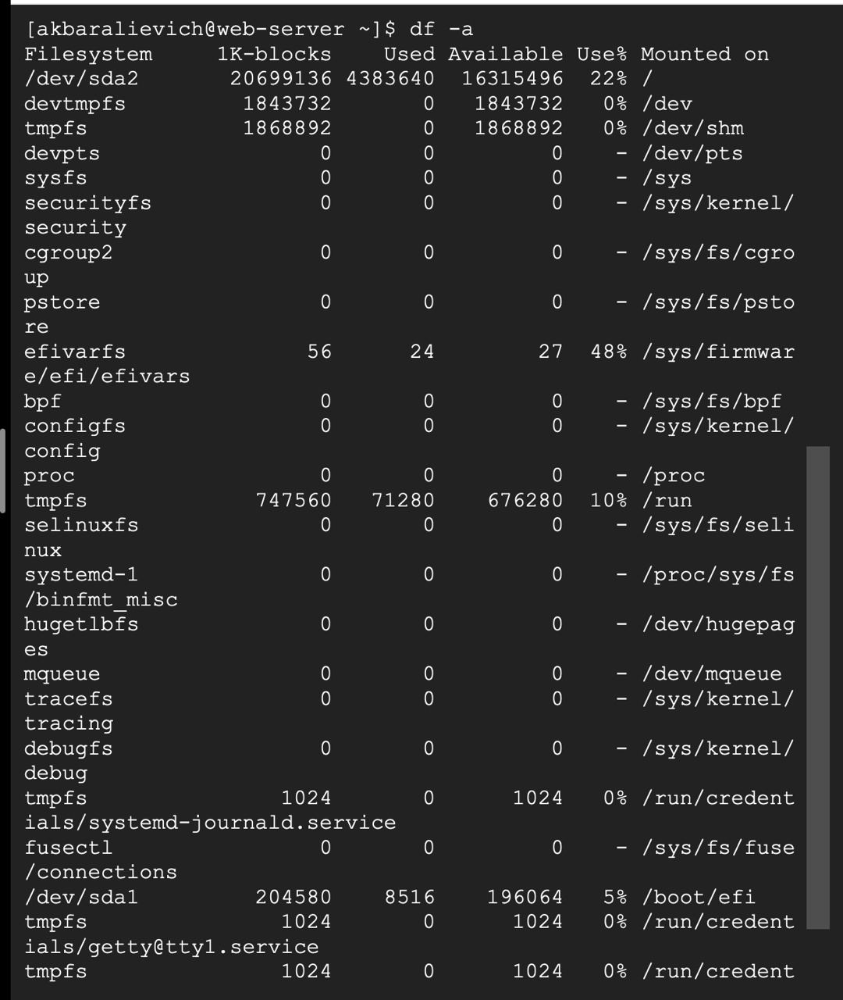
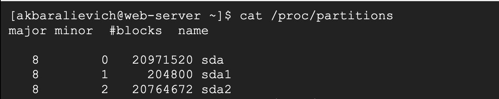
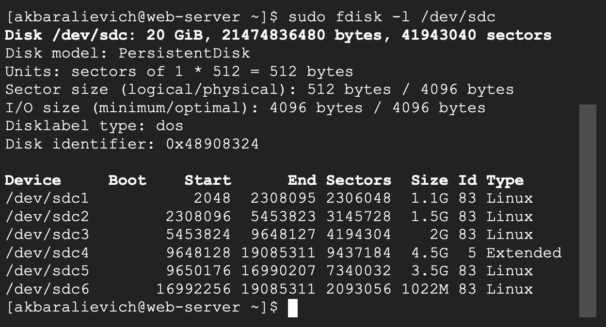
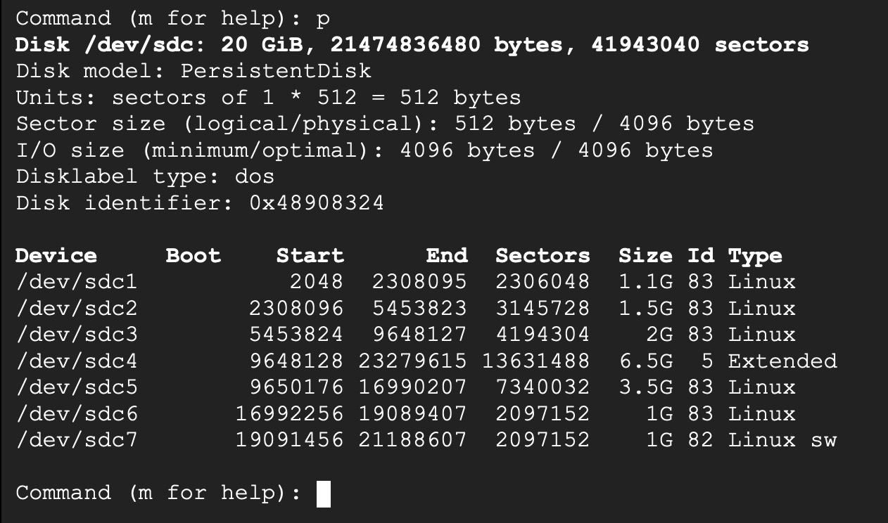
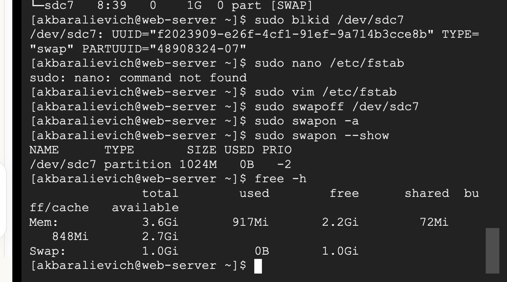
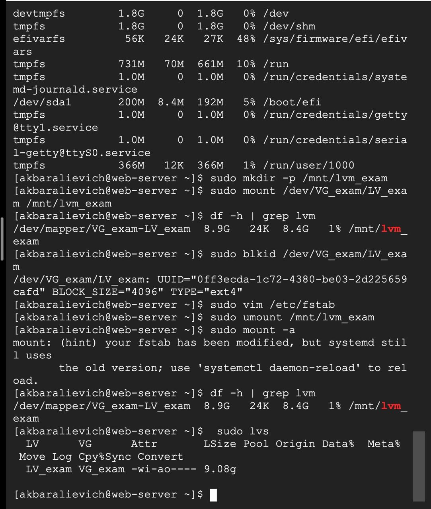
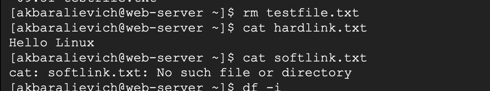
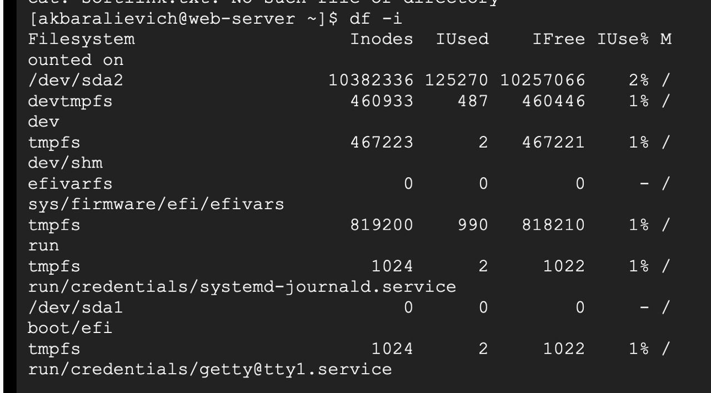

# 9-lesson 

# 1-task

 List the current partitions on all disks (fdisk, parted, lsblk, blkid, df, cat - SHU BARCHA KOMANDLAR BN KORSATING!!!)    
1. lsblk

Disk va partitionlarning daraxt ko‘rinishi

2. lsblk -f

Filesystem, UUID va mount pointlar

3. lsblk -o NAME,SIZE,TYPE,MOUNTPOINT,FSTYPE,UUID

To‘liq ustunlar bilan

4. fdisk -l

Disk partition jadvali (GPT)

5. parted -l

Grafik tarzda bo‘linmalar

6. blkid

UUID va filesystem identifikatsiyasi

7. df -a

Mount qilingan filesystemlar va bandlik

8. cat /proc/partitions

Kernel ko‘rayotgan partitionlar

Create 5 partitions from additional disk

Additional disk: /dev/sdc (20 GiB)
Partition table: DOS (MBR)

    sudo fdisk -l /dev/sdc

sdc4 — extended partition, u faqat logical partitionlar uchun konteyner.

fdisk ichida tekshiruv (p)

    Command (m for help): p

Example 

    Command (m for help): n
    Select (default p): p
    Partition number (1-4): 1
    First sector: (Enter)
    Last sector: +1.1G

In fdisk, a partition is defined as a continuous block of disk space measured in sectors (small numbered chunks, usually 512 bytes each). The first sector is the sector number where the partition starts, and the last sector is where it ends; everything between them belongs to that partition. The partition size is simply how many sectors are included: (last − first + 1), and then that number is multiplied by the sector size to get bytes. When you type +1G for the last sector, fdisk automatically calculates the correct ending sector so the partition becomes about 1 GB.

Create/enable         swap partition of 1 GB and make it permanent (survives reboot) 

1. Create a 1 GB partition
Using fdisk /dev/sdc, create a new partition of size +1G
Change its type to 82 (Linux swap)
Write changes with w

2. Format the partition as swap
    
    sudo mkswap /dev/sdc7

3. Enable swap immediately
    sudo swapon /dev/sdc7

4. Verify swap is active
    sudo swapon --show
    free -h
Shows /dev/sdc7 with size 1G

5. Make swap permanent (survive reboot)
Get UUID:
    sudo blkid /dev/sdc7
Edit /etc/fstab:
    sudo vim /etc/fstab
Add this line:
    UUID=f2023909-e26f-4cf1-91ef-9a714b3cce8b  swap  swap  defaults  0 0

6. Test fstab entry
    sudo swapoff /dev/sdc7
    sudo swapon -a

7. Final verification
    sudo swapon --show
    free -h

Swap is needed because it acts like backup memory: when RAM is not enough, Linux can move some inactive data from RAM to swap, so the system doesn’t crash and programs don’t suddenly stop.

Combine remaining non-swap partitions into one Logical Volume (LV_exam).

1. Create Physical Volumes (PVs)
    sudo pvcreate /dev/sdc1 /dev/sdc2 /dev/sdc3 /dev/sdc5 /dev/sdc6

2. Create Volume Group
    sudo vgcreate VG_exam /dev/sdc1 /dev/sdc2 /dev/sdc3 /dev/sdc5 /dev/sdc6

3. Create Logical Volume Using All Space
    sudo lvcreate -l 100%FREE -n LV_exam VG_exam

4. Create Filesystem
    sudo mkfs.ext4 /dev/VG_exam/LV_exam

5. Mount Logical Volume
    sudo mkdir -p /mnt/lvm_exam
    sudo mount /dev/VG_exam/LV_exam /mnt/lvm_exam
    Verify:
    df -h | grep lvm

6. Make LVM Mount Persistent

Get UUID:
    sudo blkid /dev/VG_exam/LV_exam

    Edit fstab:
    sudo vim /etc/fstab

    Add:
    UUID=<lv-uuid>  /mnt/lvm_exam  ext4  defaults  0 0

    Test:
    sudo umount /mnt/lvm_exam
    sudo mount -a

    Verification Commands
    lsblk
    sudo fdisk -l /dev/sdc
    sudo pvs
    sudo vgs
    sudo lvs
    df -h
    free -h

## 2-task

1) Soft link va hard link (qisqa)
Hard link - bitta faylning (bitta inodening) bir nechta nomi. Fayl o‘chmaydi, oxirgi hard link o‘chganda ketadi.
Soft link (symlink) — yo‘lga (path) ko‘rsatkich. Target o‘chsa, symlink “broken” bo‘ladi.

2) Direktoriyalar hard link bo‘ladimi?
Yo‘q (oddiy user uchun).
Sabab: tsikl (cycle) hosil bo‘lib, filesystem tuzilishi buziladi. Faqat . va .. — tizim yaratadigan maxsus linklar.

3) Faylning barcha hard linklarini ko‘rish
    ls -li file        # inode va link count
    find /path -samefile file
    yoki
    find /path -inum INODE

4) Inode nima va linklar bilan aloqasi
Inode — faylning “pasporti”: permission, owner, size, disk bloklari, link count.
Fayl nomi inode’da emas, direktoriyada saqlanadi.
Hard link — bir inode’ga bir nechta nom.
Soft link — alohida inode, ichida path bor.

/dev/sda2 (root /)
Inodes: 10,382,336
IUsed: 125,270
IFree: 10,257,066
IUse%: 2%

