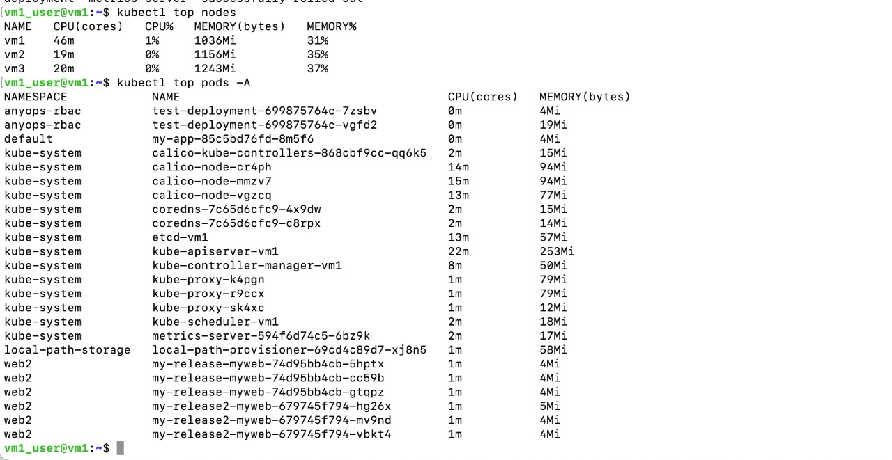
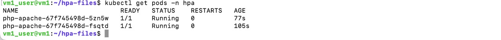
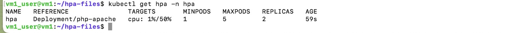
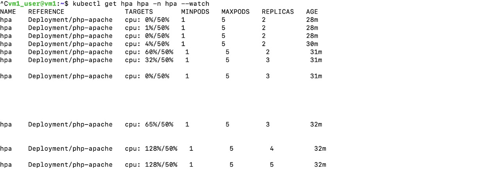
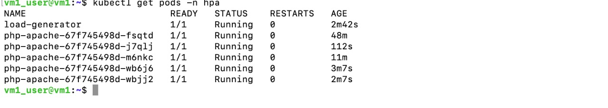
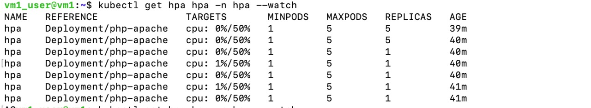

# Homework: Kubernetes HPA (Horizontal Pod Autoscaler)

In this lab I learned how HPA automatically scales pods up and down based on CPU load.

---

## Important requirements

For HPA to work:

1. The container must have CPU **requests**
2. **metrics-server** must be running in the cluster

---

## Files used

| File | What it is |
| --- | --- |
| `php-apache-deployment.yaml` | Deployment `php-apache` with CPU requests/limits |
| `service.yaml` | Service for the app (NodePort) |
| `hpa.yaml` | HPA: min 1, max 5, target CPU 50% |

---

## 1. Check metrics

```bash
kubectl top nodes
kubectl top pods -A
```



Metrics work, so metrics-server is installed.

---

## 2. Deploy the test app

Create namespace and apply manifests:

```bash
kubectl create namespace hpa
kubectl apply -f php-apache-deployment.yaml
kubectl apply -f service.yaml
kubectl get pods -n hpa
```



Deployment uses CPU requests/limits, for example:

```yaml
resources:
  requests:
    memory: "64Mi"
    cpu: "100m"
  limits:
    memory: "128Mi"
    cpu: "128m"
```

---

## 3. Create the HPA

```bash
kubectl apply -f hpa.yaml
kubectl get hpa -n hpa
```

HPA settings:

- target: Deployment `php-apache`
- minReplicas: **1**
- maxReplicas: **5**
- average CPU utilization: **50%**



Example output:

```text
NAME   REFERENCE             TARGETS      MINPODS   MAXPODS   REPLICAS
hpa    Deployment/php-apache cpu: 1%/50%   1         5         2
```

---

## 4. Generate load and scale up

Watch HPA in one terminal:

```bash
kubectl get hpa hpa -n hpa --watch
```

In another terminal, start the load generator:

```bash
kubectl run -i --tty load-generator --rm --image=curlimages/curl --restart=Never -n hpa -- \
  /bin/sh -c "while true; do curl -s --data 'millicores=300&durationSec=5' http://php-apache/ConsumeCPU; done"
```

This sends CPU-burn requests to `http://php-apache/ConsumeCPU` in a loop.

When CPU goes above 50%, HPA adds more pods.



CPU went up (for example 60% -> 128%) and replicas increased:

**2 -> 3 -> 4 -> 5**

Check pods:

```bash
kubectl get pods -n hpa
```



Now there are more `php-apache` pods (up to max 5), plus the load-generator pod.

---

## 5. Stop load and scale down

Stop the load generator with **Ctrl+C**.

Because of `--rm`, the load-generator pod is removed automatically.

If it is still there:

```bash
kubectl delete pod load-generator -n hpa
```

Watch again:

```bash
kubectl get hpa hpa -n hpa --watch
```



CPU went back near 0% and replicas scaled down (for example **5 -> 1**).

Scale down is slower than scale up. This is normal.

---

## Answers to questions

### 1. Why is CPU `requests` mandatory for HPA?

HPA does not use only "raw CPU".
It uses:

```text
current CPU / requested CPU
```

as a percentage.

If there is no `requests.cpu`, HPA cannot calculate utilization % against the target (50%).
So CPU requests are required for resource-based HPA.

### 2. What does metrics-server do?

**metrics-server** collects live resource usage (CPU/memory) from nodes and pods.

Commands like:

```bash
kubectl top nodes
kubectl top pods
```

and HPA decisions need these metrics.
Without metrics-server, HPA often shows `<unknown>` and does not scale.

### 3. Why are scale up and scale down speeds different?

- **Scale up** is faster -> app should handle high load quickly
- **Scale down** is slower -> avoid removing pods too fast if load comes back

Kubernetes uses stabilization windows so the replica count does not jump up and down too much (flapping).

### 4. Why do we need `minReplicas` and `maxReplicas`?

| Setting | Why |
| --- | --- |
| `minReplicas` | Keep at least some pods running (availability) |
| `maxReplicas` | Stop unlimited scaling (protect cluster CPU/RAM/cost) |

In this lab: min **1**, max **5**.

---

## Commands summary

```bash
# metrics
kubectl top nodes
kubectl top pods -A

# deploy
kubectl create namespace hpa
kubectl apply -f php-apache-deployment.yaml
kubectl apply -f service.yaml
kubectl apply -f hpa.yaml

# check
kubectl get pods -n hpa
kubectl get hpa -n hpa
kubectl get hpa hpa -n hpa --watch

# load
kubectl run -i --tty load-generator --rm --image=curlimages/curl --restart=Never -n hpa -- \
  /bin/sh -c "while true; do curl -s --data 'millicores=300&durationSec=5' http://php-apache/ConsumeCPU; done"

# stop load with Ctrl+C, then check
kubectl get pods -n hpa
```

---

## Cleanup

```bash
kubectl delete namespace hpa
```

---

## What I learned

- HPA scales Pods automatically based on metrics (here CPU)
- CPU **requests** + **metrics-server** are required
- `minReplicas` / `maxReplicas` control the range
- Under load, replicas go up; when load stops, replicas go down more slowly
