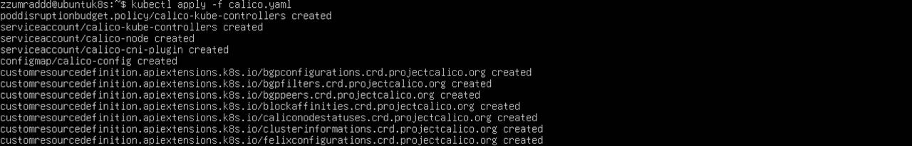
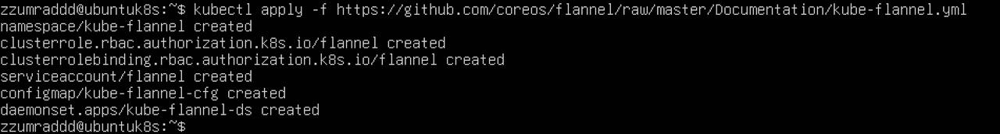
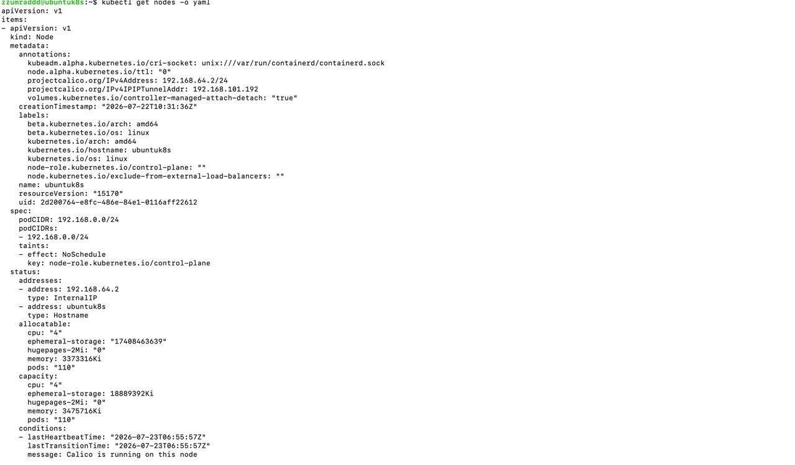
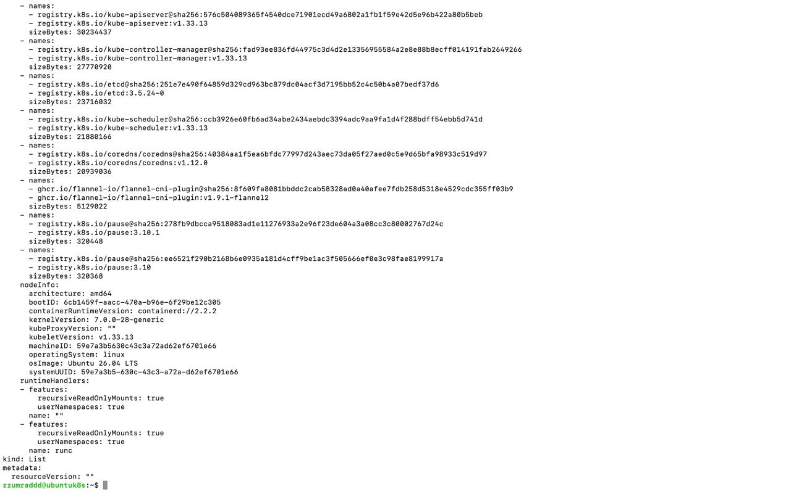
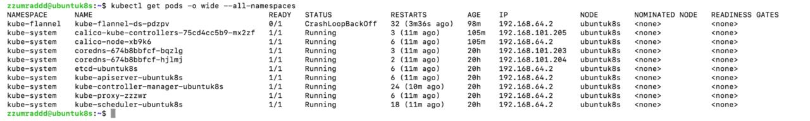
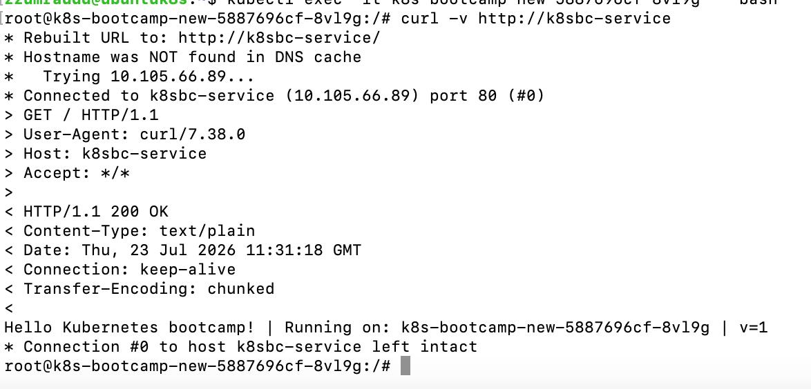

# K8S 1st Assingment(kubectl, deployments, namespaces, pods, services)

## What is k8s cluster?

A Kubernetes (K8s) cluster is a set of machines—called nodes—grouped together to run and manage containerized applications. It automates how software scales, updates, and stays online across multiple servers.

* Control Plane (The Brain)

        1. API Server: Acts as the front door that accepts user commands and queries.

        2. etcd: Saves all cluster data and system state in a safe place.

        3. Scheduler: Chooses which machine will run new application tasks.

        4. Controller Manager: Fixes problems and keeps the system in the requested state. 

* Worker Nodes (The Muscle)

        1. Pods: The smallest groups that hold one or more running application containers.
        2. Kubelet: A local agent that makes sure containers inside pods stay healthy.
        3. Container Runtime: The base software (like containerd) that runs the actual containers.
        4. Kube-proxy: Manages network traffic between different parts of the system.

    

## Bootstrap a kubernetes cluster using "kubeadm" in virtual machine

Bootstrapping a Kubernetes cluster using kubeadm in a virtual machine means setting up a working multi-node or single-node container system on a simulated computer using the official Kubernetes tool. 

    The main steps are:

    Virtual Machine (VM): Creating a private, simulated computer (using tools like VirtualBox or KVM) to act as your host server.
   
    Kubeadm: Running the official tool that installs and configures the control plane components to start the cluster.
   
    Cluster: Joining worker nodes to form a system that runs and manages containerized apps together.

Step 1: 

Installing k8s packages

        sudo apt-get update
        sudo apt-get install -y apt-transport-https ca-certificates curl gnupg

Add k8s GPG key

What is GPG key? A GPG (GNU Privacy Guard) key is a pair of cryptographic codes—a public key and a private key—used to securely encrypt data, decrypt messages, and sign digital files. It proves your identity and keeps your communications safe

        sudo mkdir -p /etc/apt/keyrings
        curl -fsSL https://pkgs.k8s.io/core:/stable:/v1.33/deb/Release.key \
        | sudo gpg --dearmor -o /etc/apt/keyrings/kubernetes-apt-keyring.gpg

Install tools

        sudo apt-get update
        sudo apt-get install -y kubelet kubeadm kubectl
        sudo apt-mark hold kubelet kubeadm kubectl

Step 2: Install Container Runtime(containerd)

        sudo apt install -y containerd
        sudo systemctl enable containerd --now

Step 3: Prepare the System

Disable Swap (Required by Kubernetes)

        sudo swapoff -a
        sudo sed -i.bak '/ swap / s/^/#/' /etc/fstab

Enable IP Forwarding

        echo "net.ipv4.ip_forward=1" | sudo tee -a /etc/sysctl.conf
        sudo sysctl -p

Step 4: Initialize the Control Plane Node

Example (Customize your cluster-endpoint and CIDR)

        sudo kubeadm init \
        --control-plane-endpoint "cluster-endpoint:6443" \
        --pod-network-cidr <IP address>"

Step 5: Configure kubectl access

        mkdir -p $HOME/.kube
        sudo cp -i /etc/kubernetes/admin.conf $HOME/.kube/config
        sudo chown $(id -u):$(id -g) $HOME/.kube/config

Then we need to insteall CNI plugin(Calico or Flannel), which is the next task

## Install a pod network add-on(calico or flannel)

A pod network add-on is a software plugin in Kubernetes that assigns unique IP addresses to pods and enables them to talk to each other across different physical or virtual servers. Popular examples include Calico, Flannel, and Cilium. 

I did both just to test both ways

    Option 1: Install Calico

    curl -O https://raw.githubusercontent.com/projectcalico/calico/v3.27.0/manifests/calico.yaml
    kubectl apply -f calico.yaml

    Option 2: Install Flannel

    kubectl apply -f https://github.com/coreos/flannel/raw/master/Documentation/kube-flannel.yml

## Provide outputs of commands

        kubectl get nodes -o yaml

kubectl get nodes — normally shows a short table: node name, status (Ready/NotReady), roles, age, and Kubernetes version.

-o yaml — instead of the short table, dumps the entire underlying object definition for every node, in YAML.

        Output:

        kubectl get pods -o wide --all-namespaces 

kubectl get pods -o wide --all-namespaces lists every pod running in the cluster, across all namespaces, with extra detail columns. 

Breaking it down:
kubectl get pods — normally lists pods only in your current namespace (usually default unless you've changed context), showing name, ready count, status, restarts, and age.

-o wide — adds extra columns to that same table: pod IP, the node the pod is running on, nominated node (for scheduling), and readiness gates.

--all-namespaces (or the shorthand -A) — instead of just your current namespace, shows pods from every namespace, adding a NAMESPACE column at the front so you can tell them apart.

        Output: 

## Working with deployments, services, yaml files...

kubectl create deployment 
       
        k8s-bootcamp-new
        --image=gcrio/google-samples/kubernetes-bootcamp:v1-port=1111

Nginx deployment + service clusterIP

        deployment-nginx.yaml

        apiVersion: apps/v1
        kind: Deployment
        metadata:
        name: nginx
        labels:
            type: nginx
            app: nginx
        spec:
        replicas: 2
        selector:
            matchLabels:
             type: nginx
             app: nginx
        template:
            metadata:
            name: nginx
            labels:
                type: nginx
                app: nginx
            spec:
            containers:
                - name: nginx
                  image: nginx

        service-nginx.yaml

        apiVersion: v1
        kind: Service
        metadata: 
         name: nginx-service
        spec:
        selector:
            app: nginx
        ports:
            - protocol: TCP
              port: 80
              targetPort: 80
        type: ClusterIP  

K8s-bootcamp + service ClusterIP

        service-k8sbootcamp.yaml
        
        apiVersion: v1
        kind: Service
        metadata: 
          name: k8sbc-service
        spec:
        selector:
            app: k8s-bootcamp-new
        ports:
            - protocol: TCP
              port: 80
              targetPort: 8080
        type: ClusterIP 

Nginx exec = ping k8s-bootcamp service or telnet to its service port

        kubectl exec -it k8s-bootcamp-new-5887696cf-8vl9g -- bash

        curl -v http://k8sbc-service

