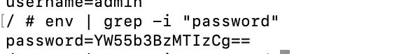
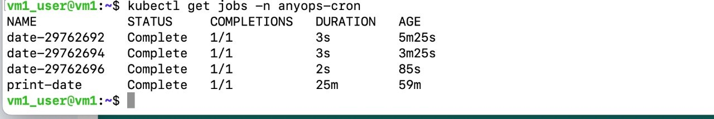
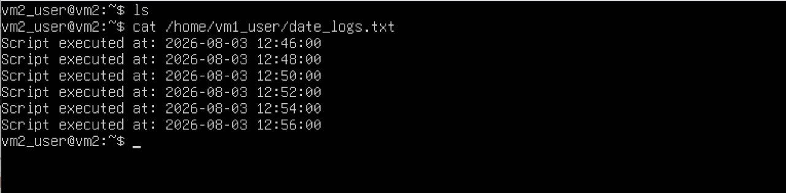
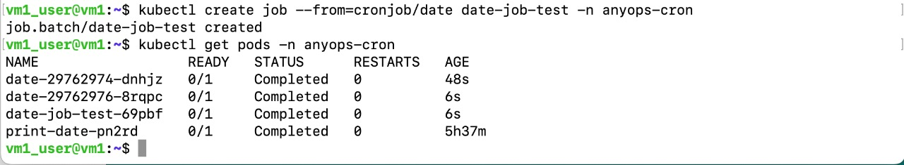

# # Homework — Jobs and CronJobs (beginner level)

## A little theory

Pods in a Deployment are supposed to keep running forever. But some work isn't like that — taking a backup, sending a report, cleaning up old files — that work should run once and finish. That's exactly what **Jobs** and **CronJobs** are for.

| Thing | What it does |
|-------|--------------|
| **Job** | Runs once, does its work, finishes. The pod ends up `Completed` and is not restarted. |
| **CronJob** | Creates Jobs for you on a schedule. Same syntax as Linux `crontab`. |

### 1. A Job that runs once and stops
Create a Job named `print-date` that:
- uses the `busybox` image
- prints the current date
- finishes and does not restart

Once it's created, check:
- What's the Job's status? (`kubectl get jobs -n anyops-cron`)

- What state did the pod end up in? (`Running`, `Completed`, something else?)

- What's in the pod's logs?

### 2. A CronJob that runs every 2 minutes

Create a CronJob named `date-logger` that:
- runs **every 2 minutes**
- logs the current time on each run
- uses the `busybox` image

After creating it, **watch for at least 5-6 minutes** and check:

- Does the CronJob show up? (`kubectl get cronjob -n anyops-cron`)

- How many Jobs were created?

- What's in each Job's logs? Are the timestamps 2 minutes apart?

### 3. Managing it (small bonus)

- **Suspend** the CronJob temporarily, then resume it.
- Trigger one Job from the CronJob **right now**, without waiting for the schedule.

## Answers

*  Why doesn't a Job's pod disappear after it finishes — why does it stay in `Completed`?

        Kubernetes keeps completed Job pods so you can inspect their logs, check exit codes, and debug any issues after the process finishes.

        A Kubernetes Job pod stays in the Completed state because Kubernetes intentionally retains finished pods so you can inspect their logs and review their exit status.

*  Can you use `restartPolicy: Always` in a Job? Why or why not?

        No, you cannot use restartPolicy: Always in a Kubernetes Job because Kubernetes rejects it with a validation error.

        Job definition: A Kubernetes Job is designed to run a task to completion and then stop.

        Allowed values: The restartPolicy for a Job's Pod template is restricted strictly to OnFailure or Never.

        Conflict of purpose: Always is meant for long-running, continuous services (like Deployments or DaemonSets) that should never finish. If a Job container finished successfully with an exit code of 0 and the policy was Always, the system would endlessly restart the finished container, defeating the purpose of a finite task.

* Do `*/2 * * * *` and `2 * * * *` mean the same thing?

        No, */2 * * * * and 2 * * * * do not mean the same thing.

        */2 * * * * (Every 2 minutes):Runs repeatedly throughout the hour.Triggers at minute 0, 2, 4, 6, 8, and so on, all the way to minute 58. Executes 30 times every hour.
        2 * * * * (At minute 2):Runs only once per hour.Triggers strictly when the clock hits 2 minutes past the hour (e.g., 1:02, 2:02, 3:02). Executes 1 time every hour.

* Does a CronJob keep old Jobs forever? How would you limit that?

        No, a Kubernetes CronJob does not keep old Jobs forever; it automatically cleans them up using built-in history limits.

        apiVersion: batch/v1
        kind: CronJob
        metadata:
        name: example-cron
        spec:
        schedule: "0 * * * *"
        successfulJobsHistoryLimit: 5  # Keep last 5 successful jobs
        failedJobsHistoryLimit: 2     # Keep last 2 failed jobs
        jobTemplate:
            spec:
            template:
                spec:
                restartPolicy: OnFailure
                containers:
                - name: task
                    image: busybox

*  If the command inside a Job exits with an error, what does Kubernetes do?

        When a command inside a Kubernetes Job exits with an error, Kubernetes determines its behavior based on the restartPolicy configured in the Pod template, eventually respecting the Job's backoffLimit.

