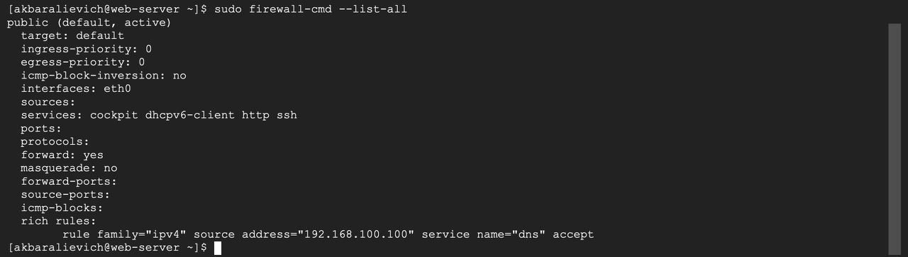
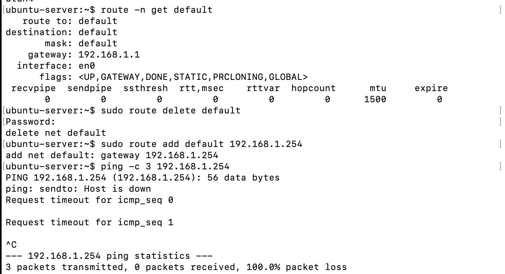
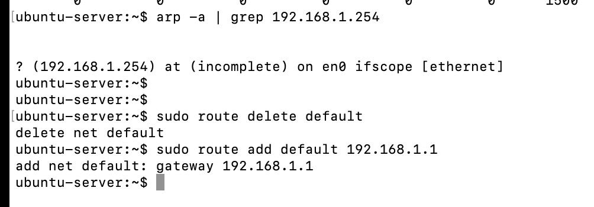
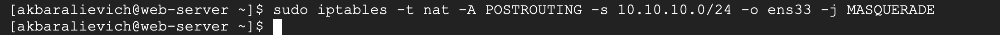
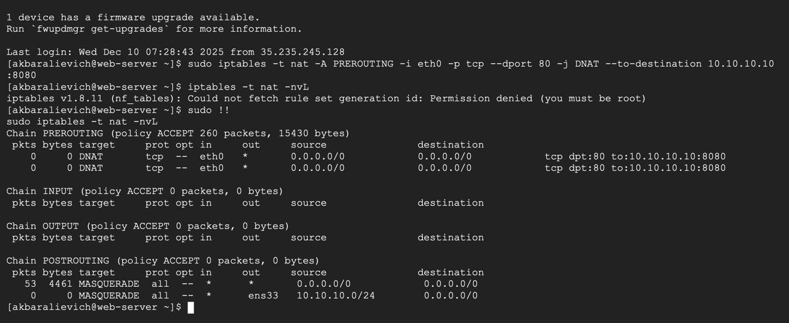
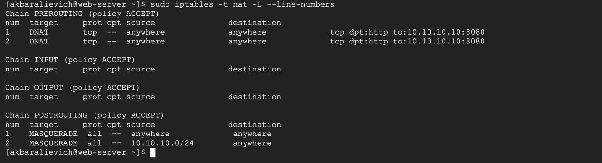
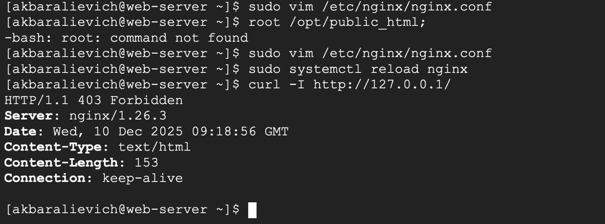
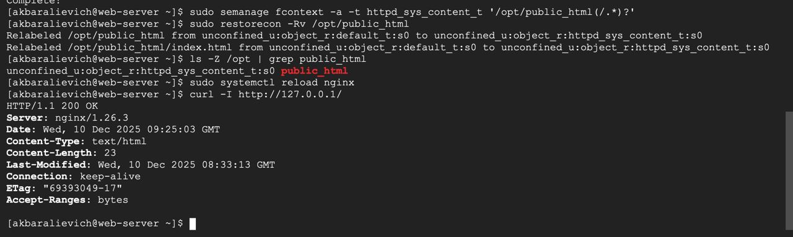
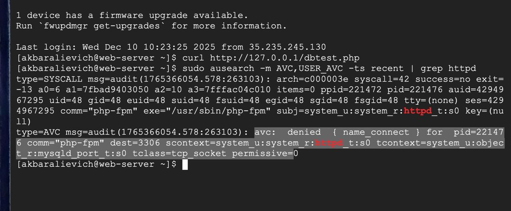
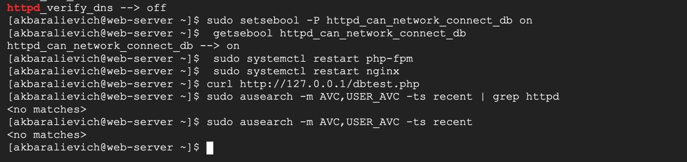

# 8-lesson Security(Firewall & SELinux)

# 1-task
Web-server deb nomlangan serverga faqat quyidagi trafikni ruxsat bering:
22 (ssh)
80 (http)
443 (https)
Lekin  faqat 192.168.56.0/24 tarmoqdan ochiq bo‘lishi kerak.
Boshqa barcha trafik  qilinsin.
ufw status verbose orqali to‘g‘ri ishlayotganini isbotlang.

    1) SETTING THE HOSTNAME
    sudo hostname set-hostname web-server
    2) (INSTALLING UFW FOR CENTOS)
    ENABLE EPEL REPOSITORY:
    sudo dnf install epel-release -y
    sudo systemctl start ufw
    3) ALLOWING THE FOLLOWING TRAFFIC THROUGH THE GIVEN IP ADRESS
    sudo ufw allow from 192.168.56.0/24 to any port <port-number>

    4) Deny or delete all incoming traffic by default system
    sudo ufw default deny incoming
    sudo ufw default allow outgoing

Moments occured and fixed outside the given task
(P.s. some rules that needed to be deleted and how they were deleted)

## 2-task

Firewalld o‘rnatilgan serverda faqat 192.168.100.100 IP manzildan kelayotgan so‘rovlar uchun xizmatiga ruxsat bering. Boshqa foydalanuvchilar uchun bu port  bo‘lishi kerak.
HTTP va SSH ochiq bo‘lishi shart.
    
    1)CHANGING ZONE
    firewall-cmd --set-default-zone=public
changed the zone to public because the trusted zone allows all traffic by default, while public enforces firewall rules so only explicitly allowed services and IPs are accepted.
    
    2)ADDING HTTP AND SSH SERVICE
    firewall-cmd --zone=public --add-service=http -permanent
    firewall-cmd --zone=public --add-service=ssh -permanent

    3)Restricting submission of DNS Queries to a sinlge ip address
    sudo firewall-cmd --permanent --add-rich-rule='rule family=ipv4 source address="192.168.100.100" service name="dns" accept'

Firewalld rich rules provide an advanced, expressive language for defining granular firewall policies that go beyond basic port and service management. They offer precise control over network traffic, allowing rules based on source and destination addresses, logging, rate limiting, port forwarding, and masquerading (NAT). 

In firewalld rich rules, specifying family="ipv4" (or ipv6) explicitly tells the firewall to apply the rule only to IPv4 traffic, which is crucial when you're targeting specific source/destination IPs or forwarding traffic, as it prevents ambiguity and ensures the rule works as intended, especially if your system handles both IPv4 and IPv6, otherwise, the rule applies to both.

#Why You Need family="ipv4" (or ipv6)

Specificity: When you use IP addresses or ranges (like 192.168.1.0/24) in a rich rule, firewalld needs to know if that address is IPv4 or IPv6.

Context: If you don't provide the family, firewalld tries to guess, but this can fail or lead to unexpected behavior, particularly if you have both types of network 
interfaces or addresses configured.

Clarity: It makes your rules self-documenting and less prone to errors when you reload or manage the firewall.

## 3-task

Serverga kelayotgan 80-portdagi trafikni  10.10.10.10:8080 ga DNAT qiling.Shuningdek, chiqayotgan trafik uchun MASQUERADE yoqing (NAT qilish). Tashqi brauzerdan http://server_ip orqali kirilganda, aslida 10.10.10.10:8080 dan xizmat ko‘rsatilishi kerak.

Network Address Translation (NAT) is a handy technique in Linux that allows multiple devices to share a single public IP address for internet connectivity.

To complete this task, IP forwarding was enabled so the server could act as a router and forward packets between interfaces.

MASQUERADE was enabled in the POSTROUTING chain to correctly rewrite source addresses for outgoing traffic, ensuring proper return routing.

DNAT was configured to redirect incoming HTTP traffic on port 80 to the internal server at 10.10.10.10:8080.

## 4-task

Serverga kelayotgan 80-portdagi trafikni  10.10.10.10:8080 ga DNAT qiling.Shuningdek, chiqayotgan trafik uchun MASQUERADE yoqing (NAT qilish). Tashqi brauzerdan http://server_ip orqali kirilganda, aslida 10.10.10.10:8080 dan xizmat ko‘rsatilishi kerak.

Preparing web directory
    sudo mkdir -p /opt/public_html
    echo "SELinux test page" | sudo tee /opt/       public_html/index.html
    sudo chown -R nginx:nginx /opt/public_html
    sudo chmod 755 /opt
    sudo chmod 755 /opt/public_html
    sudo chmod 644 /opt/public_html/index.html

Configuring nginx root
    sudo vim /etc/nginx/nginx.conf
    
Inserting
    root /opt/public_html;
    index index.html;

Apply config
    sudo nginx -t
    sudo systemctl start nginx
    sudo systemctl reload nginx

Label directory with an invalid SELinux type:
    sudo chcon -R -t default_t /opt/public_html

Testing access
    curl -I http://127.0.0.1/

 

 Install semanage 
    sudo dnf install -y policycoreutils-python-utils

    sudo semanage fcontext -a -t httpd_sys_content_t "/opt/public_html(/.*)?"
    sudo restorecon -Rv /opt/public_html

Testing again
    curl -I http://127.0.0.1/

 

## 5-task

php-fpm orqali ishlayotgan web ilova, MySQL bazasiga ulanmoqchi, lekin .
Sizga quyidagilarni qilish topshiriladi:
Avval audit.log orqali blok sababini toping.
So‘ngra,  orqali muammoni hal qiling.
 getsebool -a | grep httpd bilan boshlang.

 

  

  
