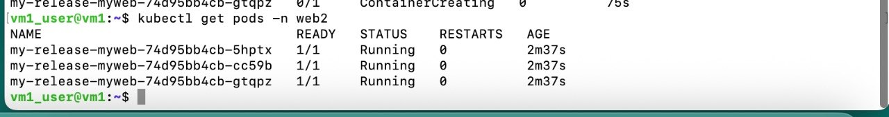
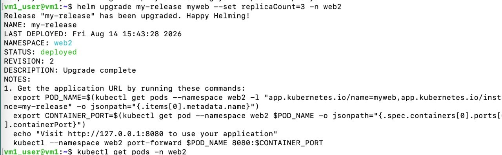
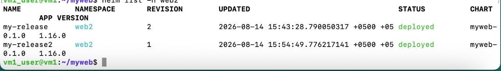
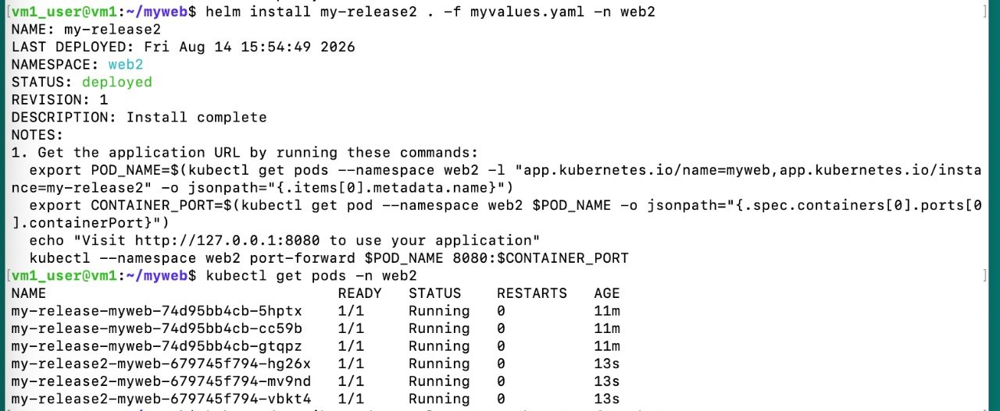
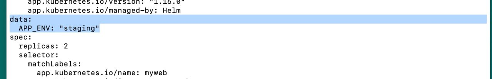

# Homework: Helm

In this lab I learned Helm — the package manager for Kubernetes.

---

## Part 1 — Create my own chart

### 1.1 Create a chart

```bash
helm create myweb
ls myweb/
```


Chart structure:

```text
myweb/
  Chart.yaml
  values.yaml
  charts/
  templates/
```

### 1.2 What each part is for

| File / folder | Purpose |
| --- | --- |
| `Chart.yaml` | Chart metadata: name, version, description, app version |
| `values.yaml` | Default config values (replicas, image, service, etc.) |
| `templates/` | Kubernetes YAML templates. Helm fills them with values |
| `charts/` | Other charts this chart can depend on (subcharts) |
| `templates/_helpers.tpl` | Reusable template snippets (named helpers) |

### 1.3 Edit `values.yaml`

I set:

```yaml
replicaCount: 2

image:
  repository: nginx
  pullPolicy: IfNotPresent
  tag: "1.27"
```


Preview without installing to the cluster:

```bash
helm template myweb ./myweb | grep -A2 replicas
```

Result: `replicas: 2`


---

## Part 2 — Install a ready-made chart (Bitnami nginx)

### 2.1 Create a namespace

```bash
kubectl create namespace web2
```

> In my cluster I used namespace **web2**.

### 2.2 Install Bitnami nginx with Helm

```bash
helm install my-release oci://registry-1.docker.io/bitnamicharts/nginx -n web2
```


Check pods and release:

```bash
kubectl get pods -n web2
helm list -n web2
```


Pod `my-release-nginx-...` is **Running**.

**Note:** Bitnami charts may warn about image changes. If you get `ImagePullBackOff`, use:

```bash
helm upgrade my-release oci://registry-1.docker.io/bitnamicharts/nginx -n web2 \
  --set image.registry=docker.io \
  --set image.repository=bitnamilegacy/nginx
```

---

## Part 3 — Increase the pod count

### 3.1 With `--set`

I installed my own chart, then upgraded replicas to 3:

```bash
helm upgrade my-release myweb --set replicaCount=3 -n web2
kubectl get pods -n web2
```





Now there are **3** pods for `my-release-myweb`.

### 3.2 With a values file (`-f`)

I created `myvalues.yaml` (or `my-values.yaml`) and installed another release:

```bash
helm install my-release2 . -f myvalues.yaml -n web2
kubectl get pods -n web2
helm list -n web2
```





Both releases are deployed:

- `my-release` — revision 2  
- `my-release2` — revision 1  

### Question: `--set` or `-f` — which is better?

**`-f` (values file) is better** for real work.

| | `--set` | `-f values file` |
| --- | --- | --- |
| Good for | Quick tests, one small change | Real installs and team work |
| Easy to save / share | No | Yes |
| Easy to review in git | No | Yes |
| Many values | Hard and messy | Clear |

Use `--set` for fast experiments. Use a values file when you want a clear, repeatable config.

---

## Part 4 — Template helpers

### 4.1 What is `_helpers.tpl`?

`templates/_helpers.tpl` holds **named templates** (helpers).

Examples already in the chart:

- `myweb.name`
- `myweb.fullname`
- `myweb.labels`
- `myweb.selectorLabels`

They are reusable pieces of template code.  
You call them like this:

```yaml
{{ include "myweb.fullname" . }}
{{ include "myweb.labels" . }}
```

**Why useful?**  
So you do not copy the same name/label logic in every file (Deployment, Service, etc.).  
Change the helper once → all templates use the new value. This is **DRY** (Don’t Repeat Yourself).

### 4.2 My own helper

I added a helper for app environment in `_helpers.tpl`, for example:

```yaml
{{- define "myweb.env" -}}
{{- default "staging" .Values.appEnv -}}
{{- end -}}
```

And in `values.yaml`:

```yaml
appEnv: staging
```

Then I used it in `deployment.yaml` (label or annotation), for example:

```yaml
APP_ENV: {{ include "myweb.env" . | quote }}
```

Check:

```bash
helm template myweb ./myweb
```

The rendered output shows the helper value, for example:

```yaml
APP_ENV: "staging"
```



---

## Answers to questions

### 1. Difference between `Chart.yaml` and `values.yaml`?

| File | What it stores |
| --- | --- |
| `Chart.yaml` | Chart info: name, chart version, app version, description |
| `values.yaml` | Default settings used by templates: replicas, image, ports, etc. |

`Chart.yaml` = “what is this chart?”  
`values.yaml` = “how should it run by default?”

### 2. Difference between `helm install` and `helm upgrade`?

| Command | Meaning |
| --- | --- |
| `helm install` | Create a **new** release |
| `helm upgrade` | Update an **existing** release |

Example: first `helm install my-release ...`, later `helm upgrade my-release ...` to change replicas.

### 3. Between `values.yaml` and `--set`, which one wins?

**`--set` wins** over the chart’s default `values.yaml`.

Order (simple view):

1. chart default `values.yaml`
2. values from `-f myvalues.yaml` (override defaults)
3. `--set` on the command line (override again)

So command-line `--set` has the highest priority.

### 4. Why is `_helpers.tpl` useful? (DRY)

Helpers store shared logic in one place (names, labels, env).  
Templates only `include` them.  
Benefit: less copy-paste, fewer mistakes, easier updates.

### 5. Relationship between `{{ define }}` and `{{ include }}`?

| | Role |
| --- | --- |
| `{{ define "name" }} ... {{ end }}` | **Create** a named helper |
| `{{ include "name" . }}` | **Use** that helper and print its result |

`define` = write the function.  
`include` = call the function.

---

## Commands summary

```bash
# Part 1
helm create myweb
# edit myweb/values.yaml
helm template myweb ./myweb | grep -A2 replicas

# Part 2
kubectl create namespace web2
helm install my-release oci://registry-1.docker.io/bitnamicharts/nginx -n web2
kubectl get pods -n web2
helm list -n web2

# Part 3
helm upgrade my-release ./myweb --set replicaCount=3 -n web2
helm install my-release2 ./myweb -f myvalues.yaml -n web2

# Part 4
helm template myweb ./myweb
```

---

## Cleanup

```bash
helm uninstall my-release -n web2
helm uninstall my-release2 -n web2
kubectl delete namespace web2
```

---

## What I learned

- Helm packages Kubernetes YAML into a **chart**
- A **release** is an installed instance of a chart
- `values.yaml` / `-f` / `--set` control config
- `helm template` previews YAML without installing
- `helm upgrade` changes a running release
- `_helpers.tpl` keeps templates clean with reusable snippets
