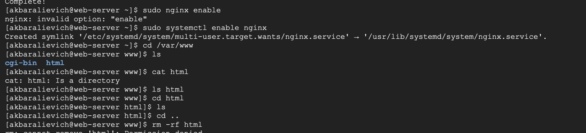
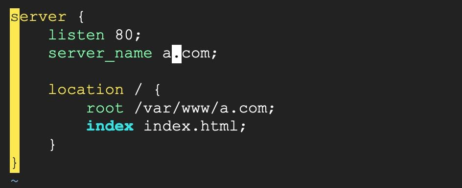
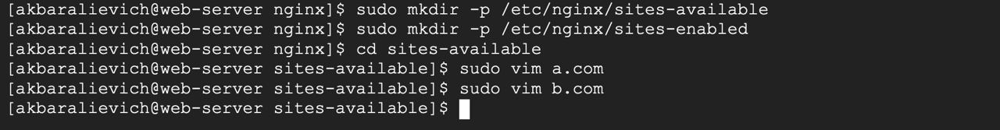
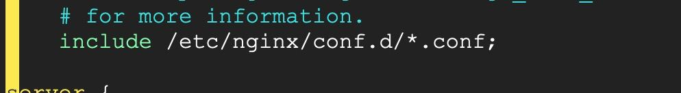

# Networking 3-lesson

# 1-task

Configure Nginx to serve two sites based on different hostnames.

# 2-task

Enable Gzip compression in Nginx for faster loading.

## 3-task

Research how Nginx can be used as a load balancer (prepare config file).

NGINX can act as a reverse proxy that sits in front of multiple backend servers. Incoming client requests are received by NGINX and then distributed across backends using a load-balancing algorithm (by default, round-robin). This improves scalability, availability, and fault tolerance: if one backend is slow or unavailable, traffic is sent to others.

    upstream backend {
        server 10.0.0.1;
        server 10.0.0.2;
    }

    server {
        listen 80;
        location / {
            proxy_pass http://backend;
        }
    }

