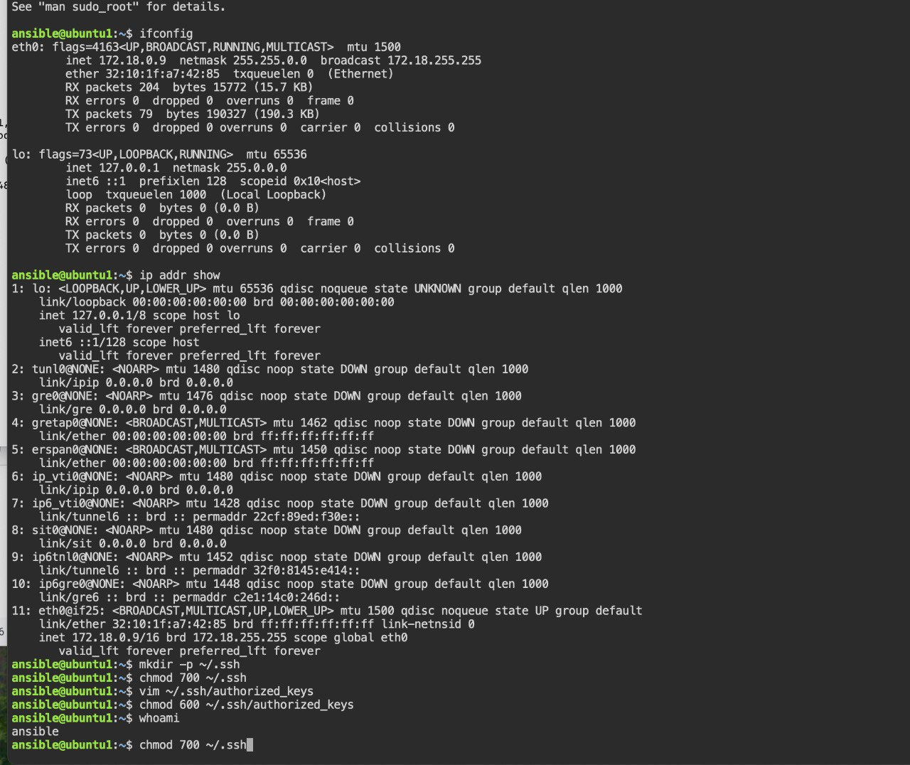
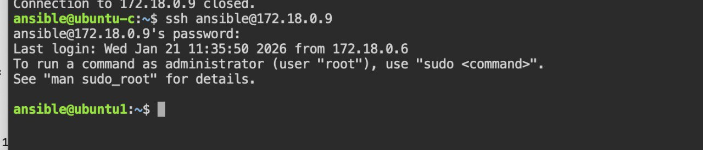
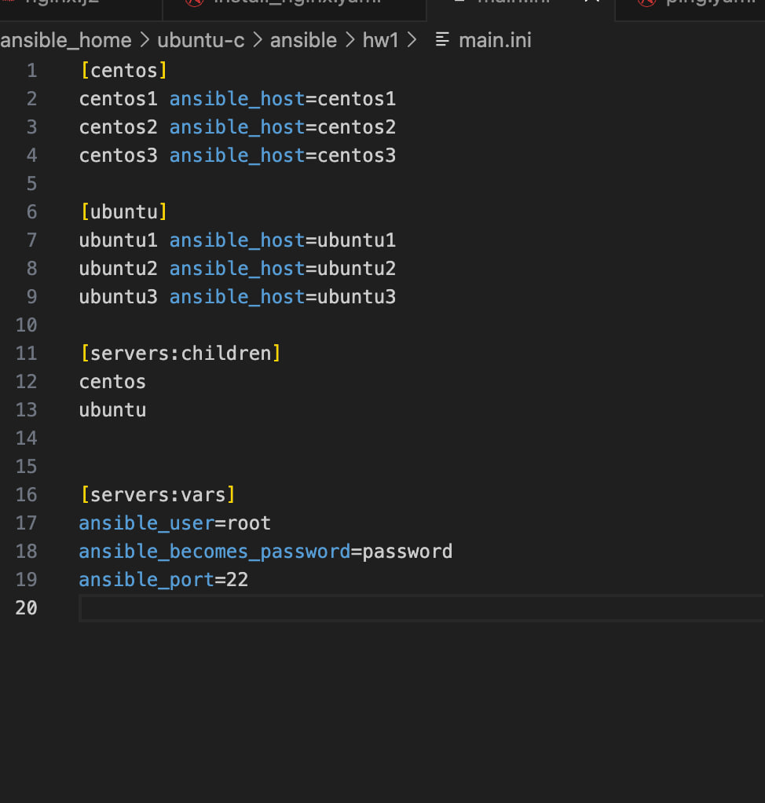
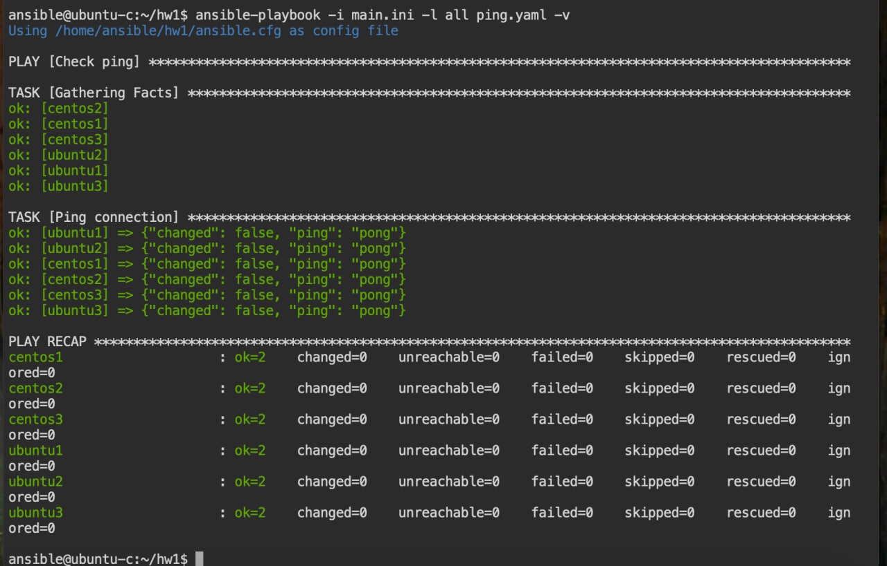
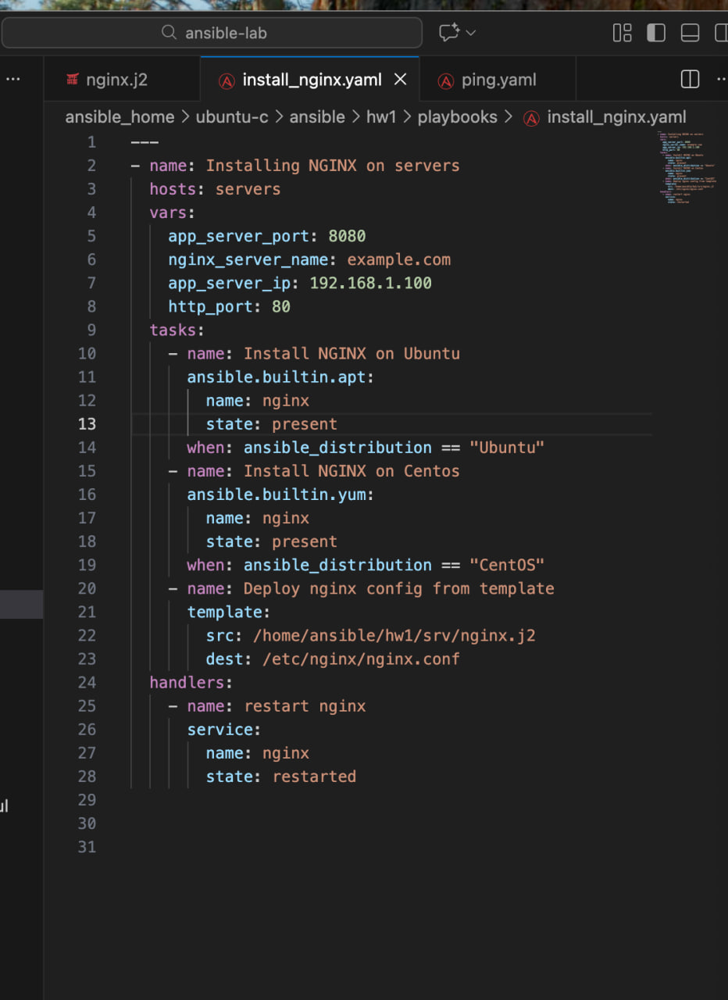
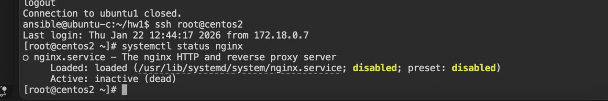
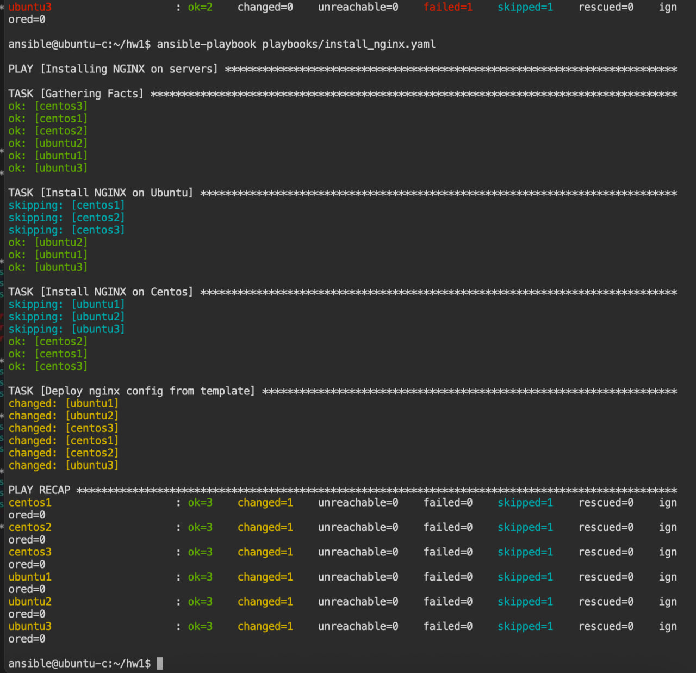
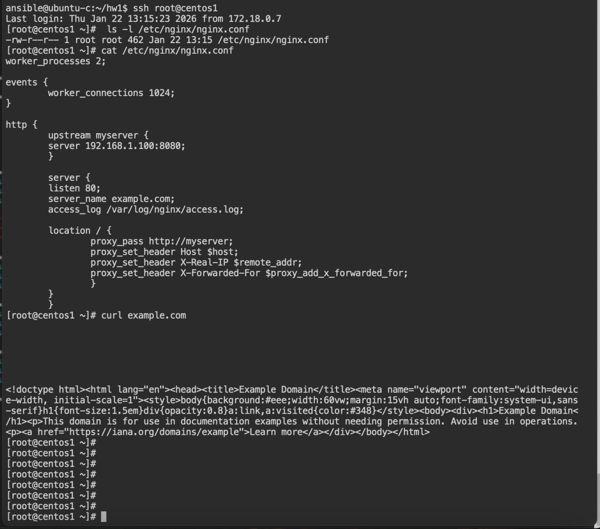

# Ansible HW 1

## 1-task

1. 🔐 Set up SSH Access
Set up SSH from your control node to both target VMs.

## 2-task

Define:

A [ubuntu] group for Ubuntu

A [centos] group for CentOS

A [servers] group including both as children

Use ansible_user and ansible_become_password variables per host

## 3-4-5-tasks

3. 📦 Write Ansible Playbook (playbooks/install_nginx.yaml)
Key requirements:

Define variables like app_server_ip, app_server_port, nginx_server_name,...

Use conditional tasks:

If RedHat (CentOS): install nginx with yum

If Debian (Ubuntu): install nginx with apt

Use a Jinja2 template for /etc/nginx/nginx.conf

Use handlers to restart NGINX

4. 🧩 Create NGINX Config Template (srv/nginx.j2)
worker_processes 2;

events {
	worker_connections 1024;
}

http {
	upstream myserver {
    	server {{ app_server_ip }}:{{ app_server_port }};
	}

	server {
    	listen {{ http_port }};
    	server_name {{ nginx_server_name }};
    	access_log /var/log/nginx/access.log;
   	 
    	location / {
        	proxy_pass http://myserver;
        	proxy_set_header Host $host;
        	proxy_set_header X-Real-IP $remote_addr;
        	proxy_set_header X-Forwarded-For $proxy_add_x_forwarded_for;
        	}
    	}
	}

5. 🚀 Run the Playbook
ansible-playbook … qoganini o’zingiz yozingiz : )

✅ It should complete without errors and configure NGINX on both servers.

