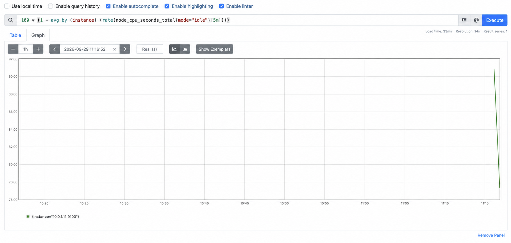
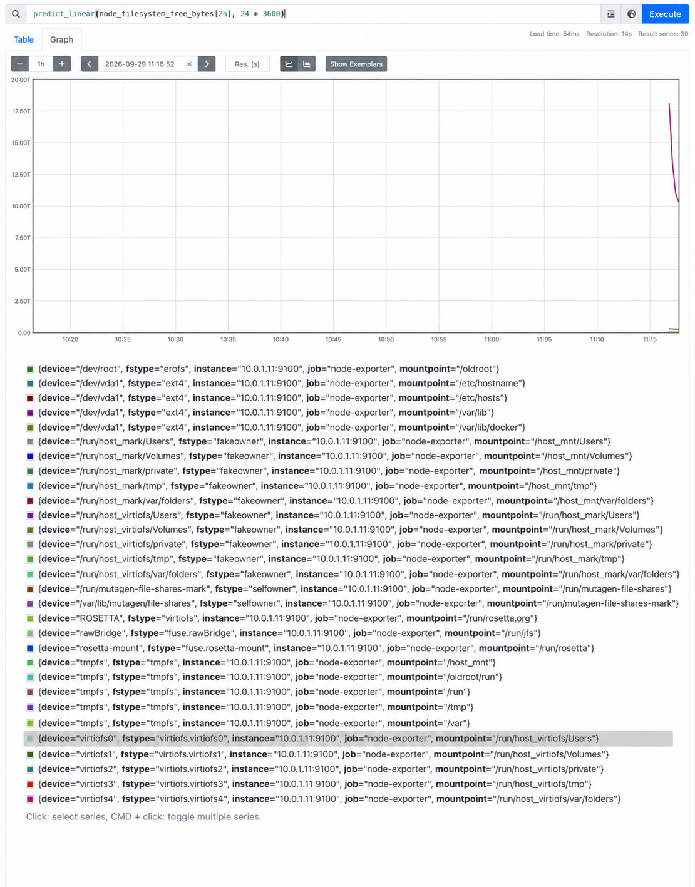
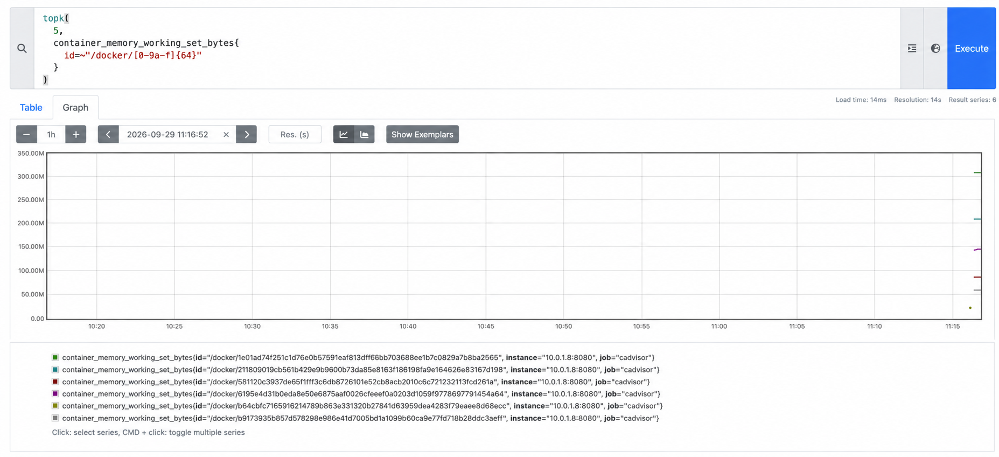
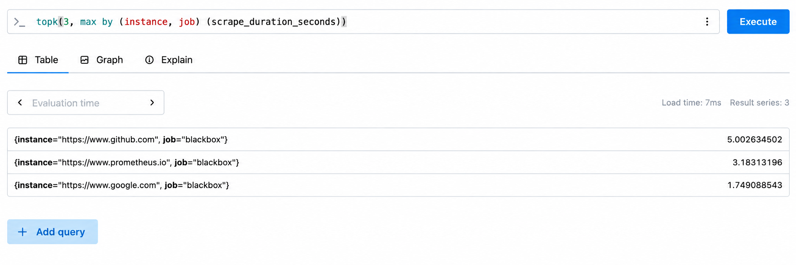

# PromQL Queries

Run these queries in the Prometheus UI at <http://localhost:9091>. Screenshots
are illustrative, so timestamps, values, labels, and displayed history may vary.

## 1. CPU busy percentage per node

```promql
100 * (1 - avg by (instance) (rate(node_cpu_seconds_total{mode="idle"}[5m])))
```

This averages idle CPU time across the cores of each node, subtracts it from
`1`, and converts the result to a busy percentage. The recording rule
`instance:node_cpu_busy_percent:rate5m` stores this result.



## 2. Disk space prediction for the next 24 hours

```promql
predict_linear(node_filesystem_free_bytes[2h], 24 * 3600)
```

This uses the previous two hours of free-space data to predict the free bytes
remaining 24 hours from now; a value at or below zero indicates likely exhaustion.
The recording rule `node_filesystem_free_bytes:predict_linear_24h` stores this
result.



## 3. Top five containers by RAM usage

```promql
topk(5, container_memory_working_set_bytes{id=~"/docker/[0-9a-f]{64}"})
```

This returns the five Docker containers with the largest active memory working
sets, identified by the `id` label exposed by this stack's cAdvisor.



## 4. Failed HTTP probes

```promql
probe_success == 0
```

This returns only Blackbox HTTP probes whose latest check failed. An empty
result means that no configured HTTP probe is currently failing.

## 5. Three targets with the highest scrape duration

```promql
topk(3, max by (instance, job) (scrape_duration_seconds))
```

This returns the three targets whose latest scrapes took the longest, grouped
by `instance` and `job`; values are measured in seconds. The recording rule
`instance_job:scrape_duration_seconds:max` stores the per-target maximum, so the
equivalent recorded query is
`topk(3, instance_job:scrape_duration_seconds:max)`.


